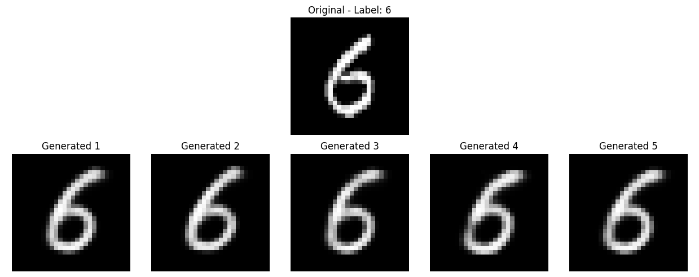
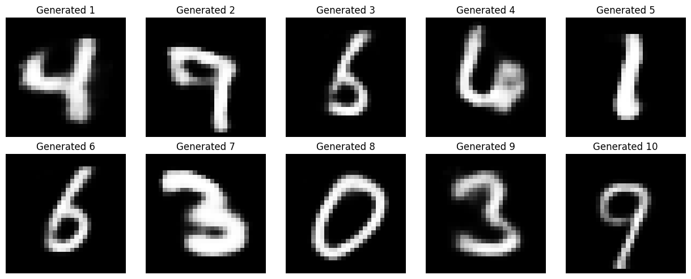
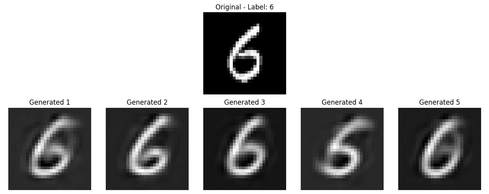
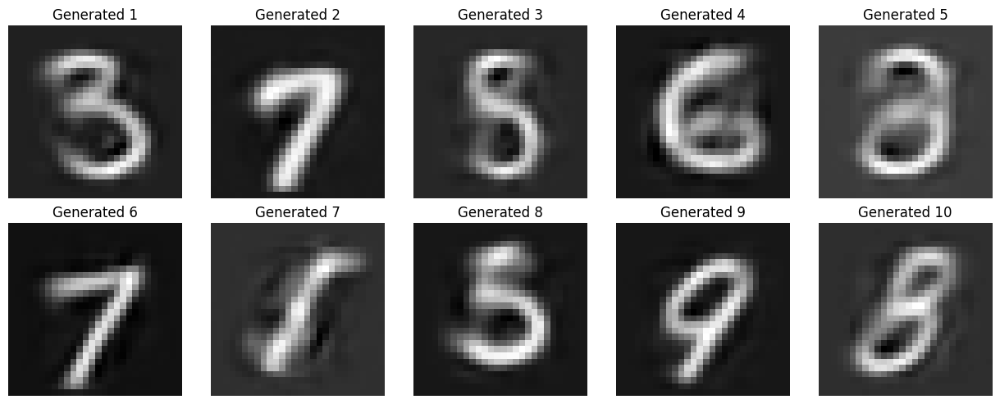
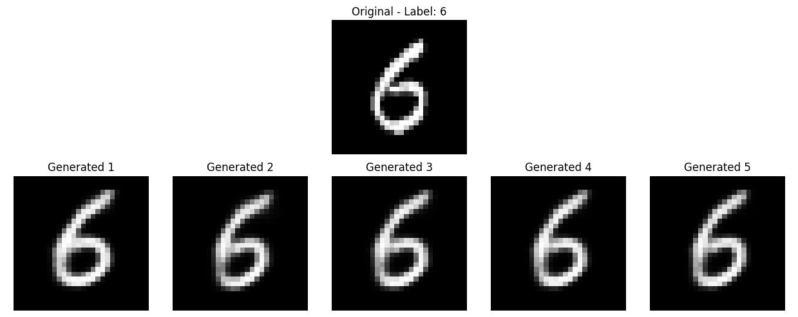
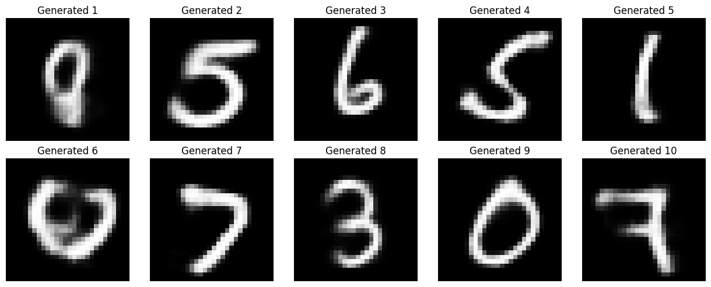
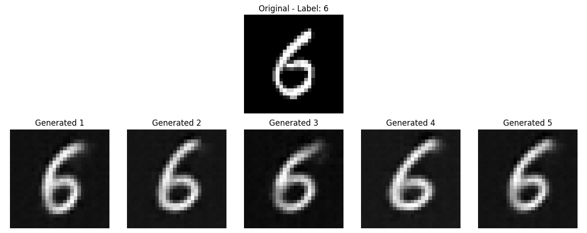
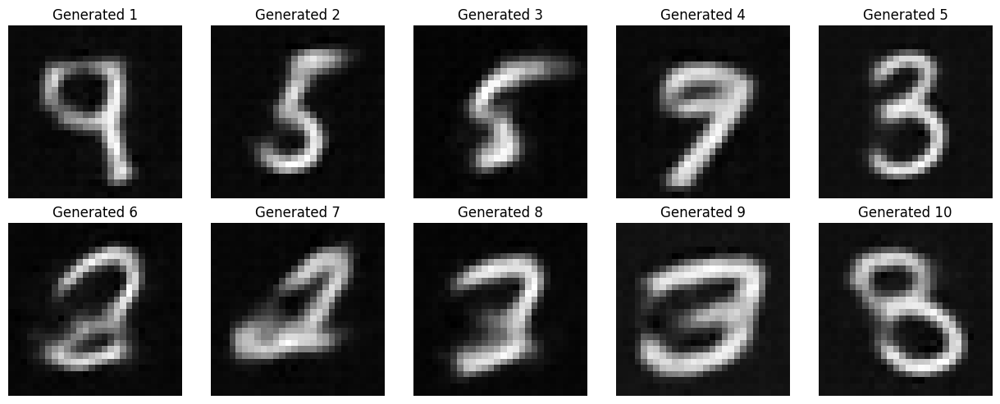

# VAE-MNIST

Educational implementation of Variational Autoencoder (VAE) for the MNIST dataset, supporting both fully connected (FNN) and convolutional (CNN) architectures. It includes training, evaluation, and empirical analysis.

## Features
- Train VAE models (FNN/CNN) on MNIST
- Configurable loss functions (BCE, MSE)
- Checkpointing and logging
- Empirical evaluation notebook
- Utilities for loading checkpoints and configuration

## Project Structure
- `main.py`: Entry point for training
- `model_fnn.py`, `model_cnn.py`: Model definitions
- `trainer.py`: Training loop and logic
- `utils/`: Utility scripts (checkpoint loading, YAML config)
- `empirical_eval.ipynb`: Notebook for empirical evaluation
- `data/`: MNIST data
- `outputs/`: Model checkpoints, logs, generated samples

## Installation
1. Clone the repository
2. Install dependencies:
   ```bash
   pip install -r requirements.txt
   ```

## Usage
- **Training:**
  ```bash
  python main.py --config config.yaml
  ```
- **Empirical Evaluation:**
  Open `empirical_eval.ipynb` in Jupyter and run the cells.

## Configuration
Edit `config.yaml` to change model, training parameters.

## Requirements
See `requirements.txt` for Python dependencies.

## Empirical analysis

- **FNN-VAEs** and **CNN-VAEs** were trained with both MSE and BCE losses.
- For each model, we visualize:
  - Reconstruction of real images (original vs. generated)
  - Generation of new images by sampling from the latent space

### Example Results

| Model         | Loss | Reconstruction Example                | Generation Example                |
|---------------|------|--------------------------------------|-----------------------------------|
| FNN           | BCE  |  |  |
| FNN           | MSE  |  |  |
| CNN           | BCE  |  |  |
| CNN           | MSE  |  |  |

### Observations

- **CNN-VAEs** outperform FNN-VAEs, likely due to better preservation of image structure.
- **BCE loss** yields better reconstructions than MSE loss in this experiment.

For detailed code and more visualizations, see the `empirical_eval.ipynb` notebook.

## License
MIT License
